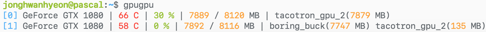

# gpugpu

Do you want to know which docker containers are currently using GPUs? `gpugpu` shows current statistics of GPUs and memory usage by running containers.

## Usage
To run it:

    $ docker run \
          --rm \
          --pid=host \
          --volume /var/run/docker.sock:/tmp/docker.sock:ro \
          jonghwanhyeon/gpugpu

## Acknowledgments
Reporting formats are inspired by [`gpustat`](https://github.com/wookayin/gpustat)